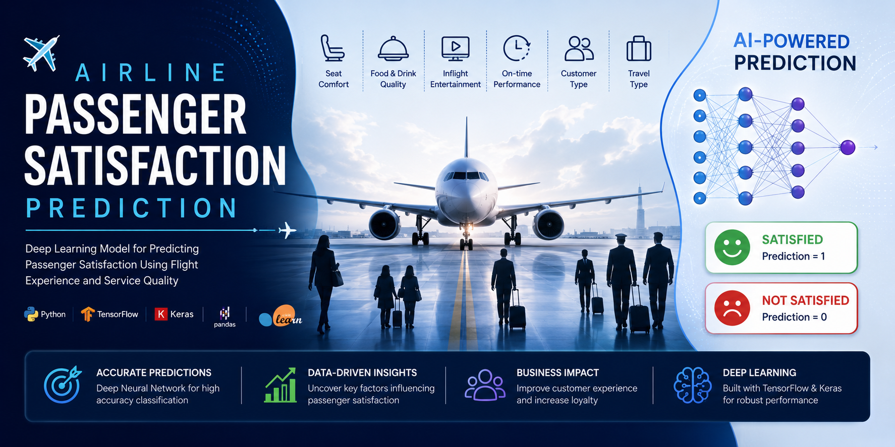
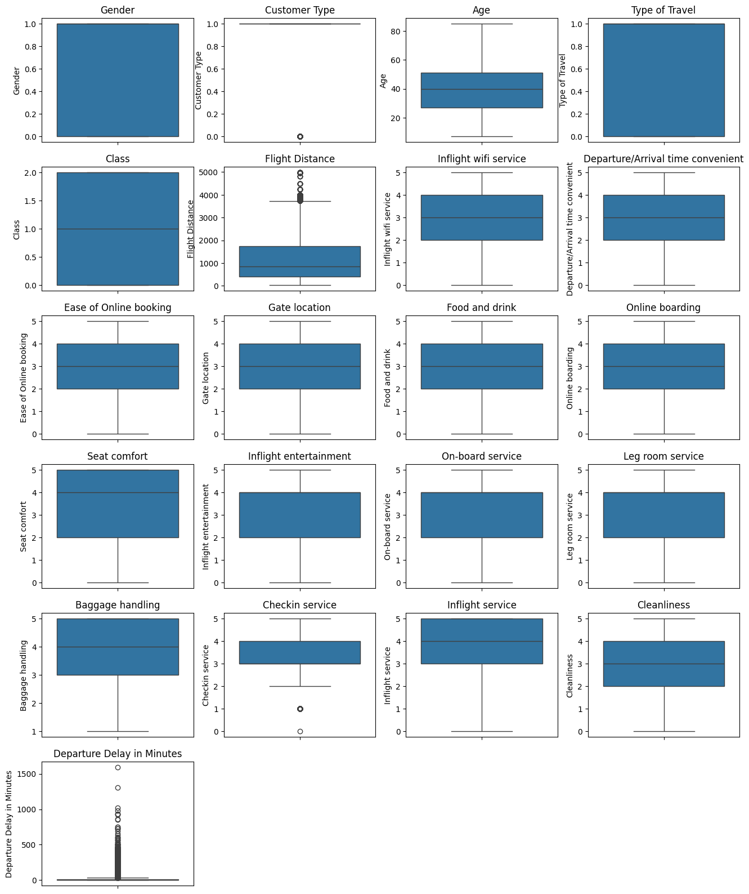
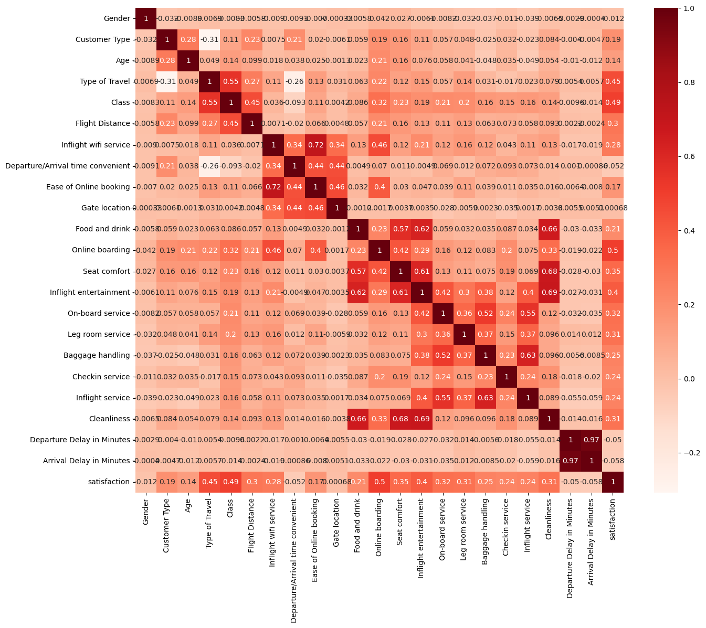
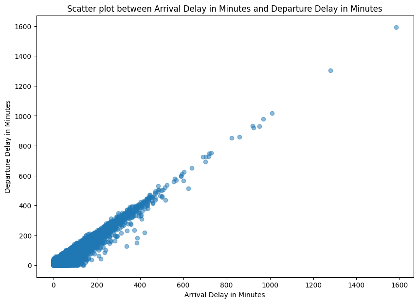
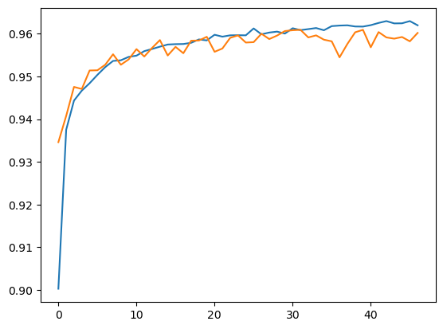

# ✈️ Airline Passenger Satisfaction Prediction using Deep Neural Networks

<p align="center">
  
</p>

<div align="center">

# Predicting Passenger Satisfaction with Artificial Intelligence

### Deep Learning • Customer Analytics • Binary Classification • TensorFlow


</div>

---

# 🌟 Project Highlights

✅ Airline Passenger Satisfaction Prediction

✅ Deep Neural Network (DNN)

✅ End-to-End Machine Learning Pipeline

✅ Feature Engineering & Data Analysis

✅ Customer Experience Analytics

✅ TensorFlow / Keras Implementation

✅ Real-World Business Application

---

# 📖 Overview

Customer satisfaction plays a critical role in the airline industry, directly impacting customer retention, brand reputation, and business growth.

This project develops a **Deep Neural Network (DNN)** capable of predicting whether a passenger is satisfied or dissatisfied based on demographic information, travel characteristics, service quality ratings, and flight delay information.

The goal is to identify dissatisfaction patterns before customer feedback is submitted, enabling airlines to proactively improve passenger experiences and service quality.

---

# 🎯 Problem Statement

Given passenger information and flight-related features:

```text
Input → Passenger & Flight Features
```

Predict:

```text
Output → Passenger Satisfaction
```

Where:

```text
1 → Satisfied
0 → Neutral or Dissatisfied
```

This task is formulated as a **Binary Classification Problem**.

---

# 💼 Business Value

Accurate passenger satisfaction prediction can help airlines:

- Improve customer retention
- Detect dissatisfaction drivers
- Optimize service quality
- Reduce customer churn
- Improve operational decision-making
- Personalize customer engagement strategies

---

# 📊 Dataset Description

The dataset contains information regarding:

- Passenger Demographics
- Customer Type
- Travel Class
- Type of Travel
- Flight Distance
- Inflight Service Ratings
- Seat Comfort Ratings
- Food & Drink Ratings
- Online Boarding Ratings
- Departure Delay
- Arrival Delay
- Overall Satisfaction

---

# 🔧 Data Preprocessing

Several preprocessing steps were applied before model training:

### Data Cleaning

- Missing value handling
- Duplicate detection
- Data validation

### Feature Engineering

- Label Encoding
- Feature Selection
- Correlation Analysis
- Outlier Investigation

### Data Scaling

- Min-Max Normalization
- Numerical Feature Standardization

---

# 📈 Exploratory Data Analysis

A comprehensive exploratory data analysis was conducted to better understand passenger behavior and the factors influencing satisfaction.

---

## 📦 Feature Distribution Analysis

Box plots were used to investigate feature distributions and identify potential outliers across numerical variables.

<p align="center">
  
</p>

### Key Insights

- Several features exhibit skewed distributions.
- Outliers are present in delay-related variables.
- Service quality ratings show relatively stable distributions.
- Understanding feature variability improves preprocessing decisions.

---

## 🔥 Correlation Analysis

Understanding feature relationships is essential for building robust predictive models.

<p align="center">
  
</p>

### Key Insights

- Strong positive relationships exist among service quality features.
- Delay-related features demonstrate significant correlation.
- Some features contribute more strongly to passenger satisfaction than others.

---

## ⏱ Delay Relationship Analysis

Departure and arrival delays were analyzed to better understand operational impacts on customer experience.

<p align="center">
  
</p>

### Key Insights

- Departure delay strongly influences arrival delay.
- Operational disruptions have a measurable impact on passenger satisfaction.
- Delay management remains a critical factor in customer experience optimization.

---

# 🧠 Deep Learning Model

A Deep Neural Network was developed using TensorFlow and Keras.

### Network Architecture

```text
Input Features
       │
       ▼
Dense Layer (128)
       │
       ▼
ReLU Activation
       │
       ▼
Dense Layer (128)
       │
       ▼
ReLU Activation
       │
       ▼
Dropout (0.5)
       │
       ▼
Dense Layer (1)
       │
       ▼
Sigmoid Activation
       │
       ▼
Passenger Satisfaction Prediction
```

---

# ⚙️ Training Configuration

| Parameter | Value |
|------------|--------|
| Optimizer | Adam |
| Loss Function | Binary Crossentropy |
| Activation | ReLU / Sigmoid |
| Validation Split | Applied |
| Framework | TensorFlow / Keras |

---

# 🚀 Model Training Strategy

To improve model performance and prevent overfitting, the following techniques were used:

- Deep Neural Networks
- Validation Monitoring
- Feature Normalization
- Data Cleaning
- Efficient Feature Selection

---

# 📊 Model Performance

The model demonstrated strong predictive capability in distinguishing satisfied and dissatisfied passengers.

<p align="center">
  
</p>

### Performance Summary

- Strong convergence during training
- Stable validation performance
- Effective learning of customer satisfaction patterns
- Suitable for real-world customer analytics applications

---

# 🛠 Technologies Used

| Category | Technologies |
|-----------|-------------|
| Programming Language | Python |
| Deep Learning | TensorFlow, Keras |
| Data Analysis | Pandas, NumPy |
| Visualization | Matplotlib, Seaborn |
| Machine Learning | Scikit-Learn |
| Development Environment | Jupyter Notebook |

---

# 📂 Project Structure

```text
airline-passenger-satisfaction-prediction/
│
├── data/
│   └── README.md
│
├── images/
│   ├── project_banner.png
│   ├── feature_boxplot.png
│   ├── correlation_heatmap.png
│   ├── delay_scatterplot.png
│   └── model_accuracy.png
│
├── notebooks/
│   └── satisfaction.ipynb
│
├── README.md
├── requirements.txt
├── LICENSE
└── .gitignore
```

---

# ⚡ Installation

Clone the repository:

```bash
git clone https://github.com/moeinalva/airline-passenger-satisfaction-prediction.git
```

Navigate to the project folder:

```bash
cd airline-passenger-satisfaction-prediction
```

Install dependencies:

```bash
pip install -r requirements.txt
```

Launch Jupyter Notebook:

```bash
jupyter notebook
```

---

# 🔮 Future Improvements

- XGBoost Comparison
- Random Forest Benchmarking
- Hyperparameter Optimization
- Explainable AI (SHAP)
- Feature Importance Analysis
- FastAPI Deployment
- Docker Containerization
- Real-Time Prediction Service

---

# 👨‍💻 Author

## Moein Alva

Machine Learning & Deep Learning Enthusiast

### Areas of Interest

- Machine Learning
- Deep Learning
- Customer Analytics
- Computer Vision
- Financial AI
- Data Science

GitHub:

```text
https://github.com/moeinalva
```

---

# 📄 License

This project is licensed under the MIT License.

---

<div align="center">

### ⭐ If you found this project useful, consider giving it a star.

### 🚀 Built with TensorFlow, Keras, and Deep Learning

</div>
